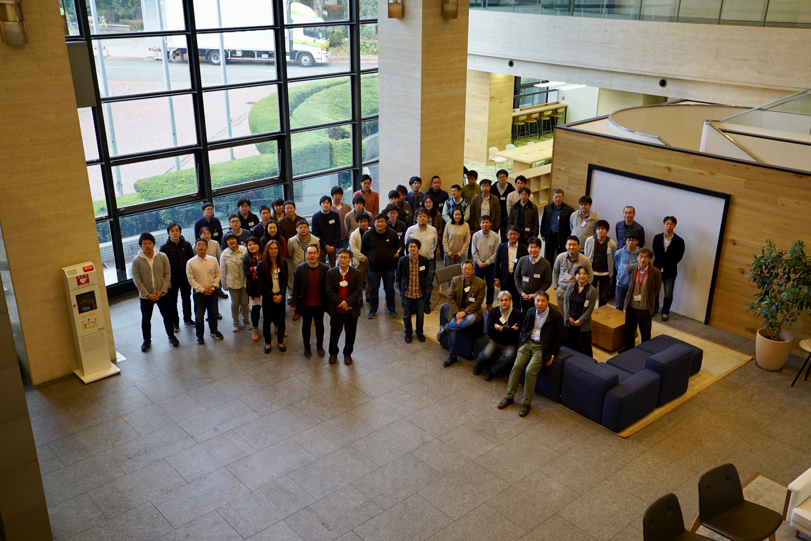

[More information here](https://indico2.riken.jp/event/2832/timetable/?view=standard)

We presented the results of HXMT observations of the new outburst source Swift J0243.6+6124 at the Japanese-China collaborative workshop.
